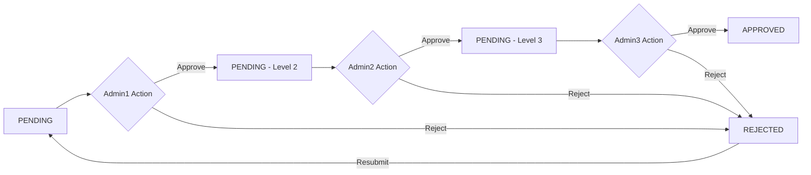

# Document Approval System - Backend

Document Approval/Signing system backend built with Go, Gin, and GORM.

## API Deployed on
<https://zakydfls.me/>

## Features

- ✅ **Document Management** - Create, view, and manage documents
- ✅ **Sequential Approval Workflow** - 3-level approval process (Admin1 → Admin2 → Admin3)
- ✅ **JWT Authentication** - Secure user authentication with role-based access
- ✅ **Role-based Authorization** - Different roles with specific permissions
- ✅ **Document Status Tracking** - Real-time status updates and approval history
- ✅ **Rejection & Resubmission** - Complete workflow for document revisions
- ✅ **Production-ready HTTP server** with Gin framework
- ✅ **Database integration** with GORM and PostgreSQL
- ✅ **Graceful shutdown** handling
- ✅ **Security middleware** (CORS, auth, validation)
- ✅ **Environment-based configuration**
- ✅ **Structured error handling** with custom messages
- ✅ **Docker support** for development and production

## Document Approval Workflow

```
Document Creation → Admin1 Approval → Admin2 Approval → Admin3 Approval → ✅ APPROVED
                         ↓                ↓                ↓
                      ❌ REJECT        ❌ REJECT        ❌ REJECT
                         ↓                ↓                ↓
                    📝 RESUBMIT ← ← ← ← ← ← ← ← ← ← ← ← ← ← ← ←
```

### Business Rules
1. **Sequential Approval**: Documents must be approved in order (Admin1 → Admin2 → Admin3)
2. **Role Enforcement**: Only the designated admin level can approve at their stage
3. **Rejection Reset**: When rejected, the approval process can be restarted from Admin1
4. **Resubmission**: Rejected documents can be revised and resubmitted

## Tech Stack

- **Language**: Go 1.21+
- **Web Framework**: Gin
- **ORM**: GORM
- **Database**: PostgreSQL
- **Authentication**: JWT
- **Password Hashing**: bcrypt
- **Configuration**: Environment variables (Godotenv)
- **Error Handling**: Custom AppError system

## Quick Start

### 1. Clone and Setup

```bash
# Clone the repository
git clone https://github.com/zakydfls/testcase.git
cd testcase

# Copy environment file
cp .env.example .env
# Edit .env file with your configuration
nano .env
```

### 2. Development Setup

```bash
# Install dependencies
go mod tidy

# Start PostgreSQL (using Docker)
docker-compose up postgres -d

# Run database migrations (auto-migrate on startup)
go run cmd/main.go
```

## Environment Variables

| Variable | Description | Default |
|----------|-------------|---------|
| `HTTP_PORT` | Server port | `8080` |
| `HTTP_ENV` | Environment mode (`development`/`production`) | `development` |
| `DB_HOST` | Database host | `localhost` |
| `DB_PORT` | Database port | `5432` |
| `DB_USER` | Database username | `postgres` |
| `DB_PASS` | Database password | `password` |
| `DB_NAME` | Database name | `testcase_db` |
| `DB_SSL_MODE` | SSL mode (`disable`/`require`) | `disable` |
| `ACCESS_TOKEN_SECRET` | JWT access token secret | `your-secret-key` |
| `REFRESH_TOKEN_SECRET` | JWT refresh token secret | `your-refresh-secret` |
| `TOKEN_EXPIRY` | Access token expiry | `24h` |
| `REFRESH_EXPIRY` | Refresh token expiry | `168h` |

## API Endpoints

### User
- `POST /api/v1/users` - User creation
- `POST /api/v1/users/login` - User login
- `POST /api/v1/users/refresh` - Refresh JWT token

### Document Management
- `POST /api/v1/documents` - Create new document
- `GET /api/v1/documents/:id` - Get document details (Public)
- `POST /api/v1/documents/:id/action` - Approve/Reject document (Auth required)
- `PUT /api/v1/documents/:id/resubmit` - Resubmit rejected document (Auth required)
- `GET /api/v1/documents` - Get pagination document

## User Roles

| Role | Description | Permissions |
|------|-------------|-------------|
| `user` | Regular user | Create documents, view own documents |
| `admin1` | First level approver | Approve/reject at level 1 |
| `admin2` | Second level approver | Approve/reject at level 2 |
| `admin3` | Final approver | Final approve/reject at level 3 |

## Document Status Flow



## API Usage Examples

### 1. User Registration

```bash
curl -X POST http://localhost:8080/api/v1/users/register \
  -H "Content-Type: application/json" \
  -d '{
    "name": "Admin One",
    "email": "admin1@example.com",
    "username": "admin1",
    "password": "password123",
    "role": "admin1"
  }'
```

### 2. User Login

```bash
curl -X POST http://localhost:8080/api/v1/users/login \
  -H "Content-Type: application/json" \
  -d '{
    "email": "admin1@example.com",
    "password": "password123"
  }'
```

### 3. Create Document

```bash
curl -X POST http://localhost:8080/api/v1/documents \
  -H "Content-Type: application/json" \
  -H "Authorization: Bearer YOUR_JWT_TOKEN" \
  -d '{
    "title": "Project Proposal Document"
  }'
```

### 4. Approve Document (Admin1)

```bash
curl -X POST http://localhost:8080/api/v1/documents/{document_id}/action \
  -H "Content-Type: application/json" \
  -H "Authorization: Bearer ADMIN1_JWT_TOKEN" \
  -d '{
    "action": "approve",
    "comment": "Approved by Admin1"
  }'
```

### 5. Reject Document

```bash
curl -X POST http://localhost:8080/api/v1/documents/{document_id}/action \
  -H "Content-Type: application/json" \
  -H "Authorization: Bearer ADMIN_JWT_TOKEN" \
  -d '{
    "action": "reject",
    "comment": "Needs revision in budget section"
  }'
```

### 6. Resubmit Document

```bash
curl -X PUT http://localhost:8080/api/v1/documents/{document_id}/resubmit \
  -H "Content-Type: application/json" \
  -H "Authorization: Bearer USER_JWT_TOKEN" \
  -d '{
    "title": "Updated Project Proposal Document"
  }'
```

## Database Schema

### Users Table
```sql
CREATE TABLE users (
    id SERIAL PRIMARY KEY,
    name VARCHAR(255) NOT NULL,
    email VARCHAR(255) UNIQUE NOT NULL,
    username VARCHAR(255) UNIQUE NOT NULL,
    password VARCHAR(255) NOT NULL,
    phone VARCHAR(20),
    role VARCHAR(50) NOT NULL DEFAULT 'user',
    is_active BOOLEAN DEFAULT true,
    created_at TIMESTAMP DEFAULT NOW(),
    updated_at TIMESTAMP DEFAULT NOW()
);
```

### Documents Table
```sql
CREATE TABLE documents (
    id UUID PRIMARY KEY DEFAULT gen_random_uuid(),
    title VARCHAR(255) NOT NULL,
    status VARCHAR(50) DEFAULT 'pending',
    current_approver INTEGER DEFAULT 1,

    -- Approval tracking
    approver1_action VARCHAR(20),
    approver1_comment TEXT,
    approver1_date TIMESTAMP,

    approver2_action VARCHAR(20),
    approver2_comment TEXT,
    approver2_date TIMESTAMP,

    approver3_action VARCHAR(20),
    approver3_comment TEXT,
    approver3_date TIMESTAMP,

    created_at TIMESTAMP DEFAULT NOW(),
    updated_at TIMESTAMP DEFAULT NOW()
);
```

## Testing

### Manual Testing

1. **Create test users** for each role:
```bash
# Admin1
curl -X POST http://localhost:8080/api/v1/users/register \
  -H "Content-Type: application/json" \
  -d '{"name":"Admin One","email":"admin1@test.com","username":"admin1","password":"password123","role":"admin1"}'

# Admin2
curl -X POST http://localhost:8080/api/v1/users/register \
  -H "Content-Type: application/json" \
  -d '{"name":"Admin Two","email":"admin2@test.com","username":"admin2","password":"password123","role":"admin2"}'

# Admin3
curl -X POST http://localhost:8080/api/v1/users/register \
  -H "Content-Type: application/json" \
  -d '{"name":"Admin Three","email":"admin3@test.com","username":"admin3","password":"password123","role":"admin3"}'
```

2. **Test approval workflow**:
   - Create document as user
   - Login as admin1 and approve
   - Login as admin2 and approve
   - Login as admin3 and approve
   - Verify document status is "approved"

3. **Test rejection workflow**:
   - Create document as user
   - Login as admin1/2/3 and reject
   - Verify document status is "rejected"
   - Resubmit document
   - Verify process restarts from admin1


## Production Deployment

### Using Docker

```bash
# Build production image
docker build -t testcase-app .

# Run with production environment
docker run -p 8080:8080 \
  -e HTTP_ENV=production \
  -e DB_HOST=your-db-host \
  -e DB_USER=your-db-user \
  -e DB_PASS=your-db-pass \
  -e DB_NAME=testcase_db \
  -e ACCESS_TOKEN_SECRET=your-secret \
  -e REFRESH_TOKEN_SECRET=your-refresh-secret \
  testcase-app
```

## Security Features

- ✅ **JWT Authentication** with access and refresh tokens
- ✅ **Password hashing** using bcrypt
- ✅ **Role-based authorization** for document actions
- ✅ **Sequential approval validation** to prevent bypassing
- ✅ **Input validation** and sanitization
- ✅ **CORS protection**
- ✅ **Error handling** without sensitive data exposure

## Contributing

1. Fork the repository
2. Create a feature branch (`git checkout -b feature/amazing-feature`)
3. Make your changes
4. Add tests for new functionality
5. Commit your changes (`git commit -m 'Add amazing feature'`)
6. Push to the branch (`git push origin feature/amazing-feature`)
7. Open a Pull Request

## License

This project is licensed under the MIT License - see the [LICENSE](LICENSE) file for details.

## Support

If you have any questions or need help with the setup, please create an issue in the repository.
